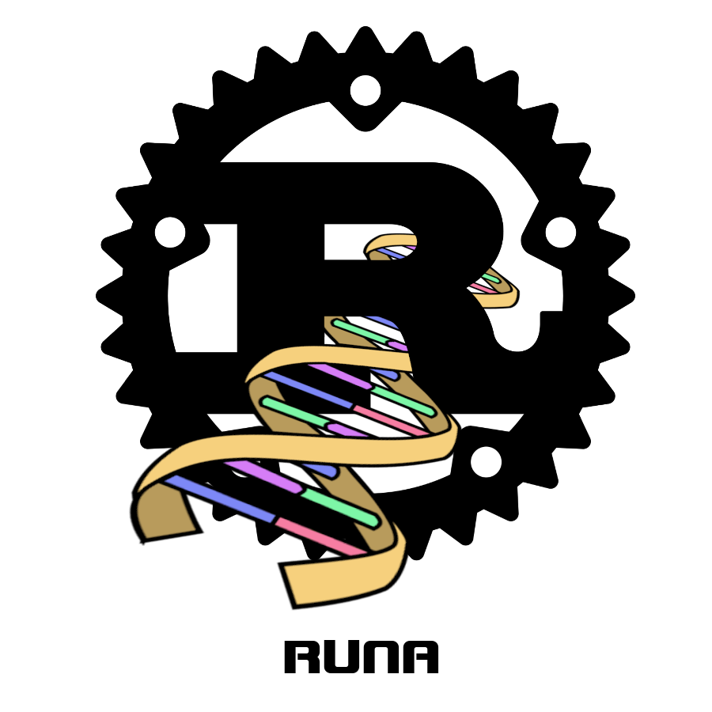

## RuNA

**RuNA** is a library for aligning DNA sequences. 
<!--  -->


## Docs 

```
https://angramme.github.io/RuNA/
```

You can also run
```
cargo doc --open
```
This will generate and open the docs on you local machine.

## Commands 

run all tests
``` 
cargo test 
```

Performance limits of all functions:
```
cargo bench
```
Generate performance graphs for (in this example dist_2, but you can switch it to a different function)
```
cargo bench -- gnuplot dist_2
```


test memory usage of a function (for example dist_2)
```
cargo build --test mem_use
GENOME_DATA=? valgrind --tool=massif ???/mem_use-? dist_2
```
One example might be:
```
GENOME_DATA=./tests/genome_instances_data/ valgrind --tool=massif ./target/debug/dep
s/mem_use-67d566998f108632 dist_2
```

You can use all other standard cargo commands, for example to generate documentation or others.
You can find all the performance tests in benches/, all the memory tests in tests/ and all the unit-tests 
at the bottom of the corresponding files. 


## Questions

[overleaf](https://www.overleaf.com/project/632486670475fd12235d011c)
